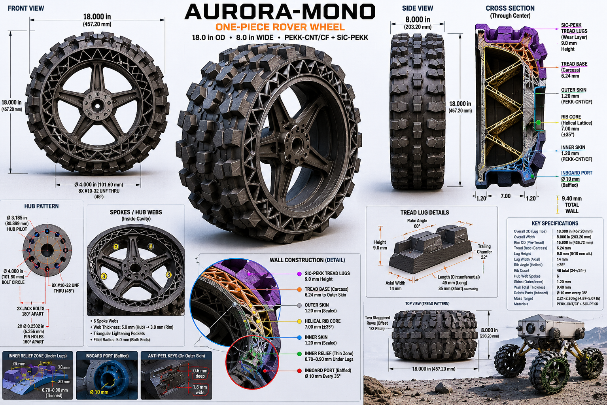
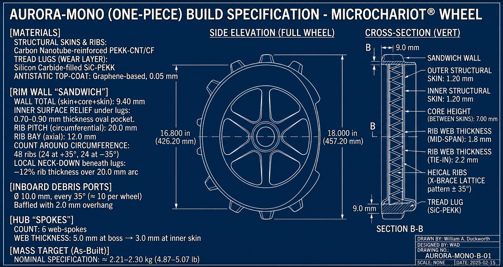

# Papers

A small collection of independent research papers by **William Duckworth**.

| # | Title | Topic | Date | PDF |
|---|-------|-------|------|-----|
| 1 | Numerical Simulation of the Riemann Hypothesis: Impact of Zero Distribution on Prime Number Distribution | Number Theory / Computation | Jan 2025 | [PDF](papers/riemann-hypothesis-numerical-simulation.pdf) |
| 2 | AURORA-Mono (One-Piece) Rover Wheel — Build Specification | Mechanical / Aerospace Engineering | 2026 | [PDF](papers/aurora-mono-wheel-build-spec.pdf) |

> Other independent work lives in its own repository:
> - **Beale Cipher 1 — exploratory analysis:** [tweak36/beale-cipher-1-analysis](https://github.com/tweak36/beale-cipher-1-analysis)

---

## 1. Numerical Simulation of the Riemann Hypothesis

**[Read the PDF](papers/riemann-hypothesis-numerical-simulation.pdf)** · 13 pages

> A Python visualization of the Chebyshev function ψ(x) and an approximation of the prime counting function π(x) under two scenarios: (a) all non-trivial zeros of ζ(s) on the critical line Re(s) = 1/2, and (b) hypothetical off-critical zeros added.

**Status:** Educational simulation, not original research. The "on-critical" zeros use a uniform-spacing approximation (γₙ ≈ 14.1347 + (n−1)·20.72) rather than true Riemann zero locations, and the "off-critical" zeros are fabricated for contrast. The plots are useful for building intuition about why RH matters for the regularity of primes; they are not evidence for or against the conjecture.

**Highlights**

- Includes the full Python source used to generate the simulations and plots (NumPy + Matplotlib) — run the code and it reproduces every figure in the paper.
- Side-by-side ψ(x) and π(x) curves under both zero distributions, with MAE / RMSE reported.
- Suitable as a teaching aid or self-study companion to a chapter on analytic number theory.

---

## 2. AURORA-Mono (One-Piece) Rover Wheel — Build Specification

**[Read the PDF](papers/aurora-mono-wheel-build-spec.pdf)** · 4 pages



*Rendered overview: front and side views of the wheel, through-center cross-section showing the X-brace helical lattice, plus detail callouts for the hub pattern, spoke webs, wall construction, tread lug geometry, inboard debris ports, anti-peel keys, and the full key-specifications table.*



*Build specification drawing AURORA-MONO-B-01 (Rev 2026-02-15): side elevation of the full wheel at 16.800 in rim OD / 18.000 in OD over lugs, vertical cross-section B-B showing the sandwich wall construction with the ±35° X-brace helical rib lattice, and materials / rim-wall / spoke / mass-target callouts.*

> A paper design study for a one-piece composite rover wheel engineered to the MicroChariot interface envelope. The design pairs a carbon-nanotube-reinforced PEKK structural cage with a silicon-carbide-filled PEKK wear tread, joined by a co-molded mechanical and chemical bond.

**Status:** Paper design + first-order Python screening analysis (see [`papers/aurora-mono-simulations/`](papers/aurora-mono-simulations/)). No FEA, no fatigue analysis, no physical prototype. Wear coefficients, contact assumptions, and the thermal schedule are estimated — not derived from coupon tests or a true thermal model. Intended for design-direction screening, not qualification.

**Highlights**

- **Envelope:** 18.000 in OD × 8.000 in wide, MicroChariot-compliant hub pattern with full keep-out compliance.
- **Sandwich rim wall:** 1.20 mm skins over a 7.00 mm helical-rib core (48 ribs at ±35°, X-brace lattice).
- **Hub torque web:** 6 internal composite web-spokes (5.0 → 3.0 mm taper) with triangular lightening pockets.
- **Tread:** integral SiC-PEKK chevron lugs in two staggered rows, 75–80% void ratio, with co-molded mechanical anti-peel keys and same-family chemical bonding at 355–365 °C.
- **Mass target (design intent):** 2.21–2.30 kg, with ~80–120 g optimization margin identified.
- Includes tolerances, a proposed manufacturing sequence (additive core → autoclave skins → machining → compression-molded tread → top-coat → NDI), and a full critical-dimensions table.

### Screening analysis

A reproducible Python screening model runs 50,000 segments (20 m each = 1000 km total) of stochastic lunar driving and reports cumulative wear, a local strip-stress safety factor, and traction margin under temperature-modulated wear coefficients. Headline numbers from the nominal run:

| Metric | Value |
|---|---|
| Final cumulative wear | 9.0 mm (of 9.0 mm nominal lug height) |
| Minimum safety factor | 3.14 |
| Fracture flags (SF < 1) | 0 |
| Min traction margin on a 20° slope | μ = +0.036 (positive) |

**Sensitivity sweep** (±50% / ±25% on the four dominant parameters): the design is robust on stress (min SF stays above 2.1 across all perturbations, zero fracture flags), but the wear answer is dominated by the `instant_contact_fraction` assumption — at the worst-case end of that assumption, predicted wear reaches 18 mm, exceeding the lug height. That assumption is the highest-priority unknown to measure.

**Lug-shear check** at the SiC-PEKK / outer-skin co-molded bond: nominal SF 26.6, worst-plausible (single lug bearing all load) SF 13.3. Shear is not the limiting failure mode.

**Peel check** (the mode the anti-peel keys are designed for) — bending stress at the bond edge under eccentric loading from cresting a rock: SF 6.1 at the worst rock event with the load offset to the lug edge. SF stays ≥1.8 across a full sensitivity grid on the chemical allowable and key multiplier; SF 12–58 in any realistic non-extreme case.

Full code, CSVs, plots, and complete documentation of what the screening models do **not** capture (no FEA, no fracture mechanics, no real thermo, no fatigue, no thermal-cycle stress, no rib-lattice analysis): [`papers/aurora-mono-simulations/`](papers/aurora-mono-simulations/).

**Open work before this would be a real engineering artifact:** fracture-mechanics peel analysis using measured G_c, Miner's-rule fatigue accumulator on the skin and bond, thermal-cycling stress from differential CTE, FEA on the rib lattice under lunar loading, a real thermal model (radiation balance + 1D conduction), coupon-test wear coefficients against JSC-1A regolith simulant, coupon-test bond strength, prototype build and bench test.

---

## Repository layout

```
.
├── README.md
├── images/
│   ├── aurora-mono-overview.png
│   └── aurora-mono-build-spec.png
└── papers/
    ├── riemann-hypothesis-numerical-simulation.pdf
    ├── aurora-mono-wheel-build-spec.pdf
    └── aurora-mono-simulations/
        ├── README.md
        ├── aurora_mono_screening_model.py
        ├── aurora_mono_screening_summary.csv
        ├── aurora_mono_screening_records.csv
        ├── sensitivity_sweep.py
        ├── sensitivity_sweep_results.csv
        ├── lug_shear_check.py
        ├── lug_shear_check_results.csv
        ├── peel_check.py
        ├── peel_check_results.csv
        ├── peel_check_sensitivity.csv
        └── plots/
            ├── wear_vs_distance.png
            ├── safety_factor_running_min.png
            ├── thermal_cycle.png
            ├── sensitivity_wear.png
            └── sensitivity_min_sf.png
```

## Citing

If you reference either paper, please cite as:

> Duckworth, W. *Numerical Simulation of the Riemann Hypothesis: Impact of Zero Distribution on Prime Number Distribution.* 2025.

> Duckworth, W. *AURORA-Mono (One-Piece) Rover Wheel — Build Specification, Rev 1.0.* 2026.

## License

Unless otherwise stated, the papers in this repository are released under the
[Creative Commons Attribution 4.0 International License (CC BY 4.0)](https://creativecommons.org/licenses/by/4.0/).
