# AURORA-Mono — First-Order Screening Analysis

A coordinated set of reproducible Python screening models for the [AURORA-Mono](../aurora-mono-wheel-build-spec.pdf) one-piece rover wheel. Together they cover wear, structural margins under driving loads, bond shear and peel, Miner's-rule fatigue, and thermal-cycling stress from CTE mismatch over the lunar diurnal cycle.

## Status — read this first

**These are *screening* analyses, not qualification analyses.**

- None of the checks here are finite element analysis. Stress checks use closed-form models (strip stress, beam bending, Euler/Johnson columns, lumped-parameter viscoelasticity).
- Thermal input to the wear model is a prescribed temperature schedule, not a radiation/conduction simulation.
- No fracture mechanics. No crack growth, no spallation prediction.
- All material allowables — wear coefficient, bond strength (shear, peel, S-N), CTE, Prony coefficients — are estimated from published bulk PEKK / PEEK behavior, not measured for the actual SiC-PEKK and PEKK-CNT/CF formulations.
- No prototype has been built or physically tested.

The purpose is **design-direction screening**: confirm the wheel is in the right ballpark before committing to detailed simulation or test, and surface the assumptions that would dominate the answer at next fidelity.

## What the main screening model computes

For 50,000 segments of 20 m each (1000 km total):

| Quantity | How it's computed |
|---|---|
| Per-segment temperature | Prescribed schedule cycling through −170, −100, −40, 0, +60 °C with dwell hours weighted to a Moon-like duty |
| Per-segment wear depth | Archard-style: `k(T) · F · L_slide / H_tread`, distributed over a contact area `2πR·W · 0.20 · 0.20` |
| Wear coefficient `k(T)` | Linear interpolation between 1.8e-4 (warm) and 3.8e-4 (cold) |
| Terrain | Stochastic categorical (60% loose / 30% compact / 10% rocky) with terrain-specific available μ |
| Rock impact events | 5% per segment, with rock-size fractions sampled from a heavy-tailed distribution; load spike up to 4× static |
| Side impacts | 2% per segment; load × 1.2 |
| Local stress | `F / (10 mm × 1.2 mm)` — a single strip across the outer skin |
| Safety factor | `σ_allow / σ_local`, with 160 MPa allowable for the PEKK-CNT/CF skin |
| Traction margin | `μ_available − μ_required(20°)` |

## Headline results

From `aurora_mono_screening_summary.csv`:

| Metric | Value |
|---|---|
| Distance simulated | 1000 km |
| Static load per wheel | 127.6 N (Moon gravity, 45 kg rover + 270 kg payload, 4 wheels) |
| Max load seen (rock event) | 612 N |
| Rock events | 2,429 / 50,000 segments |
| Side impacts | 961 / 50,000 segments |
| **Final cumulative wear** | **9.0 mm** (of 9.0 mm nominal lug height — i.e. lugs fully worn at end of life) |
| **Minimum safety factor** | **3.14** (on the local strip-stress check) |
| Fracture flags (SF < 1) | 0 |
| Median traction margin | μ = +0.186 (well above the 0.364 required for a 20° slope) |
| Minimum traction margin | μ = +0.036 (just above zero on a 20° slope in the worst sampled segment) |

### Plots

| | |
|---|---|
| 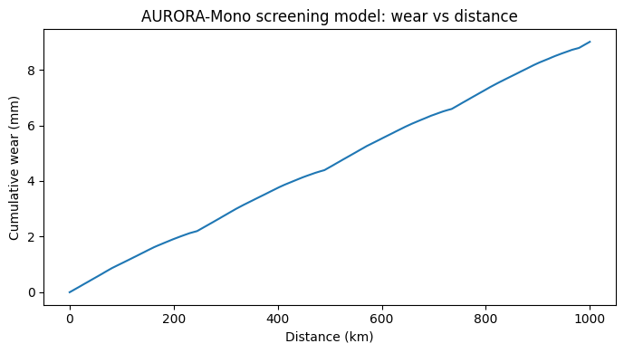 | 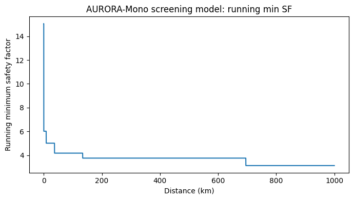 |
| Cumulative wear vs distance | Running minimum safety factor |

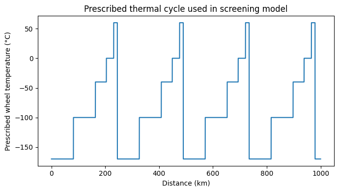
*Prescribed wheel-temperature schedule used to modulate the wear coefficient.*

## How to reproduce

Requires Python 3.x with NumPy, pandas, and matplotlib.

```bash
pip install numpy pandas matplotlib
python aurora_mono_screening_model.py
```

Every script in this folder is deterministic (`np.random.seed(7)`) — anyone running them reproduces the same numbers.

## Sensitivity sweep — [`sensitivity_sweep.py`](sensitivity_sweep.py)

One-at-a-time sensitivity on the four dominant parameters of the main screening model, ±50% and ±25%:

| Parameter | Effect on wear | Effect on min SF |
|---|---|---|
| `wear_k_cold` | linear: 5.3 → 12.8 mm | none (no load coupling) |
| `instant_contact_fraction` | **inverse, dominant: 18.0 → 6.0 mm** | none |
| `payload_mass_kg` | linear: 5.1 → 12.9 mm | 5.5 → 2.2 |
| `dynamic_spike_factor` | small: 8.5 → 9.5 mm | 6.3 → 2.1 |

At the worst-case end of the contact-fraction assumption (−50%, i.e. only 2% of the wheel surface in contact at any instant), cumulative wear reaches **18 mm — exceeding the 9 mm nominal lug height**. That single assumption dominates the wear answer and is the highest-priority parameter to nail down with measurement.

Minimum safety factor stays above 2 across all ±50% perturbations, with zero fracture flags in every run.

| | |
|---|---|
| 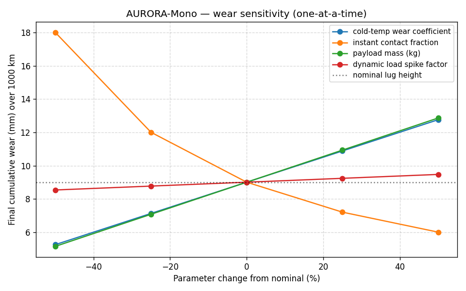 | 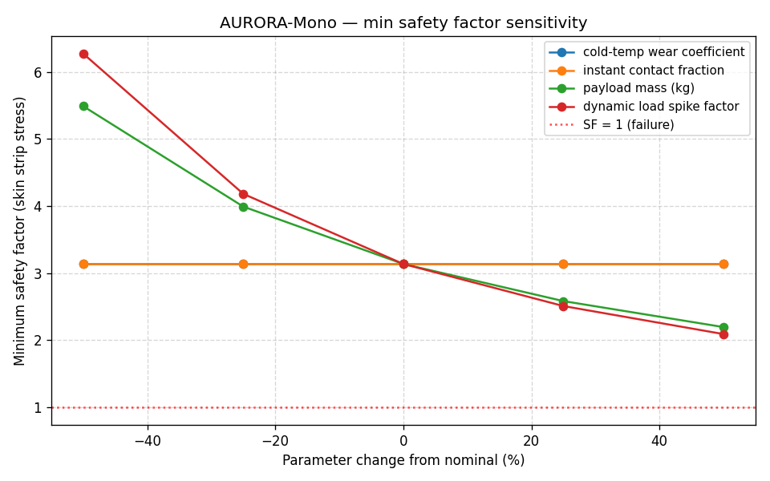 |
| Final wear vs ± parameter change | Min safety factor vs ± parameter change |

Outputs: [`sensitivity_sweep_results.csv`](sensitivity_sweep_results.csv).

## Lug-shear check — [`lug_shear_check.py`](lug_shear_check.py)

Screening check on the SiC-PEKK tread / PEKK-CNT/CF outer-skin co-molded bond. Uses the mission's peak normal load (612 N from the worst rock event in the stochastic history), the maximum terrain traction coefficient (μ = 0.55, loose terrain), and distributes the resulting tangential force across the estimated 2 lugs in instantaneous contact. Applies a 2.5× edge-stress concentration factor.

| Case | Shear stress (design) | Safety factor |
|---|---|---|
| Nominal (2 lugs in contact) | 0.75 MPa | **26.6** |
| Worst plausible (1 lug bearing all load) | 1.50 MPa | **13.3** |

Allowable shear is set at 20 MPa, derived conservatively as 40% of the low end of PEKK bulk shear strength (50 MPa). Anti-peel mechanical interlock from the keying grooves is **not** credited.

The lug-to-skin bond is not the limiting failure mode in pure shear. Peel-mode loading is analyzed in `peel_check.py`.

Outputs: [`lug_shear_check_results.csv`](lug_shear_check_results.csv).

## Peel check — [`peel_check.py`](peel_check.py)

The mode the anti-peel keys are specifically designed for. When the wheel crests a rock, the contact patch shifts to one edge of a lug, putting that lug under a bending moment that wants to lift its trailing edge.

The model treats each lug as a rigid rectangular pad bonded to the skin and applies the per-lug normal load at a horizontal offset `e` from the centerline. The peak peel stress at the trailing edge follows from beam bending: `σ_peak = 6·M / (b·L²)`. This is compared against an effective allowable that combines the chemical bond strength (5 MPa, conservative for thermoplastic same-family co-mold) with a multiplier crediting the mechanical anti-peel keys (2.0× nominal).

**Nominal cases** (chemical 5 MPa × 2.0× key multiplier = 10 MPa effective):

| Case | Peak peel stress | Safety factor |
|---|---|---|
| Cruise, centered load (e = 0) | 0 MPa | ∞ |
| Cruise, moderate eccentricity (e = L/4) | 0.17 MPa | 58.5 |
| Cruise, worst eccentricity (e = L/2) | 0.34 MPa | 29.3 |
| Worst rock event, moderate eccentricity | 0.82 MPa | 12.2 |
| **Worst rock event, worst eccentricity (e = L/2)** | **1.64 MPa** | **6.1** |

**Sensitivity** on the two most uncertain inputs (chemical allowable and key multiplier), at the worst-case load and offset:

| Chemical allowable | Key multiplier | Effective allowable | SF (worst case) |
|---|---|---|---|
| 3 MPa | 1.0× (no key credit) | 3 MPa | 1.8 |
| 5 MPa | 1.0× | 5 MPa | 3.0 |
| 5 MPa | 2.0× (nominal) | 10 MPa | **6.1** |
| 10 MPa | 2.0× | 20 MPa | 12.2 |
| 15 MPa | 3.0× (optimistic) | 45 MPa | 27.4 |

Adequate peel margin under nominal assumptions. The worst case in the entire sensitivity grid (no key credit + lowest plausible chemical allowable) still gives SF 1.8 — marginal but positive. Most realistic combinations yield SF 3–12.

This is a stress-based screening check, not fracture mechanics. The correct next-fidelity step is a G_c-based crack-propagation analysis using a measured critical strain energy release rate for the actual co-mold bond.

Outputs: [`peel_check_results.csv`](peel_check_results.csv) and [`peel_check_sensitivity.csv`](peel_check_sensitivity.csv).

## Fatigue check (driving loads) — [`fatigue_check.py`](fatigue_check.py)

Miner's-rule fatigue damage accumulator on both the rim skin and the lug-skin bond peel under driving cycles. For each segment in the mission, the screening model's recorded stress is used to compute damage per Miner's rule (`D = Σ n_i / N_f(σ_i)`); failure at `D = 1.0`, fatigue safety factor is `1/D`. Wheel circumference and segment length give ~14 stress cycles per segment, ~696,000 cycles total over 1000 km.

S-N curves use a Basquin-style log-linear fit calibrated to `N_f = 1` at the static strength and `N_f = 10⁶` at a representative endurance limit. Stresses below the endurance limit accumulate zero damage (infinite-life assumption).

| Component | σ_static | Endurance ratio R_e | Endurance limit | Stress range observed | Cycles above endurance | Total damage D | Fatigue SF | Implied life |
|---|---|---|---|---|---|---|---|---|
| Skin (PEKK-CNT/CF) | 160 MPa | 0.40 | 64 MPa | 10.6 – 51.0 MPa | **0** | 0 | ∞ | ∞ |
| Bond peel (nominal, with keys) | 10 MPa | 0.25 | 2.5 MPa | 0.17 – 1.64 MPa | **0** | 0 | ∞ | ∞ |

Every cycle, on both components, falls below the endurance limit:

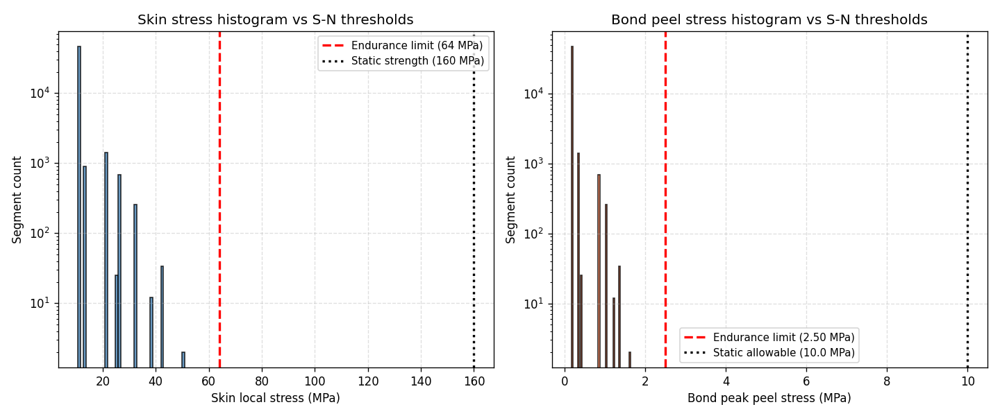

**Sensitivity** on the bond, sweeping chemical allowable (3, 5, 7 MPa), key multiplier (1, 2, 3×), and endurance ratio (0.20, 0.25, 0.30) — 27 combinations:

| Combination | Fatigue life |
|---|---|
| Most adverse (3 MPa chem × no key credit × R_e = 0.20) | ~7,200 km |
| Adverse (3 MPa chem × no key credit × R_e = 0.25) | ~14,600 km |
| 5 MPa chem × no key credit × R_e = 0.20 | ~161,000 km |
| Nominal (5 MPa chem × 2× key × R_e = 0.25) | infinite |
| Most combinations with key credit | infinite |

The design has enough static margin that driving-load fatigue is not the governing failure mode. Even the most adverse parameter combinations show fatigue life > 7× the 1000 km design distance.

This check does **not** capture mean-stress effects (Goodman / Soderberg), load-sequence interaction, or crack-growth-based life prediction. Thermal-cycling stress from differential CTE is a separate analysis (`thermal_cycle_check.py`).

Outputs: [`fatigue_check_summary.csv`](fatigue_check_summary.csv) and [`fatigue_check_sensitivity.csv`](fatigue_check_sensitivity.csv).

## Thermal-cycling check — [`thermal_cycle_check.py`](thermal_cycle_check.py)

> **This is the screening check that surfaces a real margin concern. Read this section carefully.**

When the wheel sits on the lunar surface, the bonded interface between the SiC-PEKK tread and the PEKK-CNT/CF outer skin sees cyclic stress from differential thermal expansion. The lunar diurnal swing is ΔT ≈ 300 K (−173 to +127 °C) over a 29.5-day cycle, giving ~12.4 thermal cycles per Earth year.

The constrained-strain upper bound on interfacial stress is `σ = E_tread · Δα · ΔT`. Real peak peel at lug edges is some fraction of this bound; the model sweeps a "peel recovery factor" from 0.3 (heavily relaxed) to 1.0 (no relaxation).

**Material assumptions** (estimated, not measured):

| Material | E | α (CTE) |
|---|---|---|
| Tread SiC-PEKK | 5 GPa | 29 ppm/K |
| Skin PEKK-CNT/CF (in-plane) | 50 GPa | 10 ppm/K |
| **Δα** | | **19 ppm/K** |

**Nominal result** (Δα = 19 ppm/K, edge recovery factor = 0.40, ΔT = 300 K):

| Quantity | Value |
|---|---|
| Interior constrained shear (full cycle) | 28.5 MPa |
| Estimated peak peel at lug edge | 11.4 MPa |
| Bond effective allowable | 10.0 MPa |
| **Static SF on edge peel** | **0.88** |
| Stress vs bond endurance limit (2.5 MPa) | 11.4 MPa ≫ 2.5 MPa → cycles count toward fatigue |
| Cycles to failure | ~0.5 |
| **Implied bond fatigue life** | **~15 days (less than one lunar day)** |

**Sensitivity** on the two most uncertain inputs:

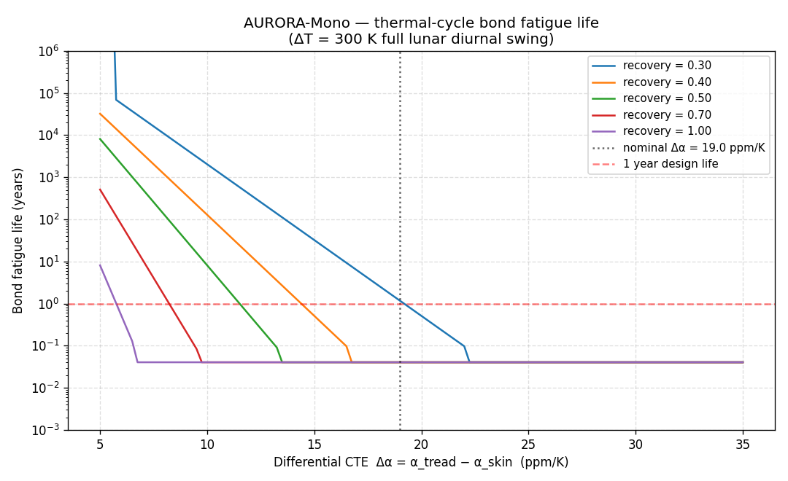

| Δα (ppm/K) | Recovery factor | Edge peel | Static SF | Fatigue life |
|---|---|---|---|---|
| 10 | 0.30 | 4.5 MPa | 2.22 | ~2,000 years |
| 10 | 0.40 | 6.0 MPa | 1.67 | ~130 years |
| 15 | 0.30 | 6.75 MPa | 1.48 | ~32 years |
| 15 | 0.40 | 9.0 MPa | 1.11 | ~186 days |
| **19** (nominal) | **0.40** (nominal) | **11.4 MPa** | **0.88** | **~15 days** |
| 19 | 0.30 | 8.55 MPa | 1.17 | ~1.2 years |
| 25 | any | ≥11.25 MPa | ≤0.89 | ≤15 days |
| 30 | any | ≥13.5 MPa | ≤0.74 | ≤15 days |

**Honest verdict**

Under the nominal estimated material properties, **thermal cycling alone is the dominant failure mode candidate**. The constrained-strain peak peel stress (~11 MPa) is slightly above the bond's static allowable (~10 MPa), and well above its endurance limit (2.5 MPa). The driving-load checks (strip stress, lug shear, lug peel, driving-cycle fatigue) all showed comfortable margins; this passive thermal check is the one that doesn't.

**The numerical result is highly sensitive to assumptions.** The constrained-strain model is intentionally conservative — it does NOT credit:

- Viscoelastic / creep relaxation in PEKK during long lunar-day dwells at +127 °C (Tg ≈ 165 °C is uncomfortably close — meaningful creep is expected). This is partially addressed by `viscoelastic_relaxation_check.py`.
- Through-thickness compliance of the sandwich wall.
- Any compliant interlayer between SiC-PEKK and PEKK-CNT/CF.
- Edge geometry detail (chamfers, fillets) that distributes the singularity.

The result *should* be read as: **this is the failure mode to instrument and design against**, not "the design fails." A real evaluation needs viscoelastic FEA with measured material properties.

**Mitigations to consider in any next design iteration:**

- Compliant interlayer (e.g. unfilled PEKK strip) between tread and skin to absorb CTE mismatch.
- Reformulate SiC-PEKK with higher SiC vol-fraction to drop α_tread.
- Lower-modulus / lower-CTE skin layup in the regions under each lug.
- Edge geometry (chamfered lug bases, scalloped transitions) to spread the strain singularity.
- Active or passive thermal management at the bond.

Outputs: [`thermal_cycle_check_summary.csv`](thermal_cycle_check_summary.csv) and [`thermal_cycle_check_sensitivity.csv`](thermal_cycle_check_sensitivity.csv).

## Viscoelastic relaxation screening — [`viscoelastic_relaxation_check.py`](viscoelastic_relaxation_check.py)

> **This is NOT finite element analysis.** True FEM requires solver tooling and a meshed CAD model. This is a 1D generalized-Maxwell stress-relaxation model with Arrhenius time-temperature superposition that addresses the dominant missing physics in the thermal-cycling check — PEKK creep at +127 °C — and gives a more realistic picture of how the bond stress evolves over the diurnal cycle.

The model time-steps a 3-cycle simulation through the cool-down / cold-dwell / heat-up / hot-dwell phases, applying elastic stress increments from ΔT and Prony-series relaxation during dt. Material parameters are educated estimates from published PEEK/PEKK behavior — not measured for the actual SiC-PEKK formulation.

**Result — the relaxation does very different things at the two extremes of the cycle:**

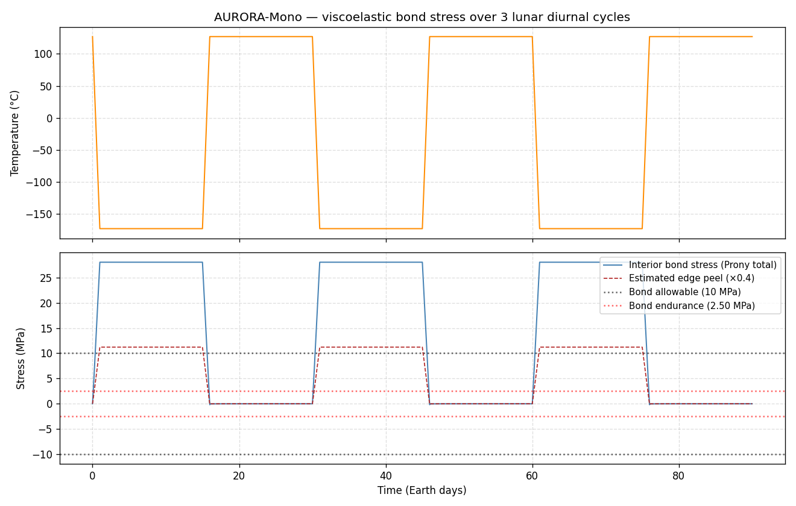

| Metric | Elastic upper bound | Viscoelastic relaxation |
|---|---|---|
| Peak interior stress (post cool-down) | 28.5 MPa | 28.0 MPa |
| Peak edge peel | 11.4 MPa | 11.2 MPa |
| **Static SF on edge peel** | **0.88** | **0.89** (essentially unchanged) |
| Stress amplitude per cycle (edge) | 11.4 MPa (treated as fully reversed) | **5.6 MPa** (asymmetric 0-to-peak) |
| Implied fatigue life | ~15 days | **~247 years** |

**Why the static SF didn't change much:** cool-down happens fast (~24 hours) and reaches cold temperatures (−173 °C) where the Arrhenius shift effectively freezes relaxation. The peak stress builds up elastically and holds across the 14-day cold dwell with negligible decay.

**Why fatigue life improved dramatically:** during the hot dwell, the bond is at +127 °C (near PEKK's Tg ≈ 165 °C) and the Prony series collapses the stress back toward zero over 14 days. The stress *amplitude* per cycle is therefore (peak − 0) / 2 ≈ 5.6 MPa rather than the elastic-check's symmetric ±11.4 MPa swing. 5.6 MPa is above the bond's endurance limit (2.5 MPa) but well below static — fatigue accumulates slowly.

**Sensitivity** on Arrhenius temperature sensitivity (Ea/R) and permanent-term Prony weight (the two largest unknowns):

| Ea/R (K) | Permanent w_∞ | Edge max | Edge amplitude | Static SF | Fatigue life |
|---|---|---|---|---|---|
| 6,000 | 0.30 | 10.88 MPa | 5.50 MPa | 0.92 | ~322 y |
| 10,000 | 0.50 | 11.21 MPa | 5.64 MPa | 0.89 | ~247 y |
| 15,000 | 0.70 | 11.34 MPa | 5.69 MPa | 0.88 | ~226 y |

Across the full sensitivity grid, the **static SF stays in the 0.88–0.92 range**: stubbornly below 1.0 regardless of Prony assumptions. The fatigue life stays in the 226–322 year range: comfortable regardless.

**Honest verdict**

Crediting realistic viscoelastic relaxation **does not resolve the thermal-cycling margin concern** — but it does *change the nature* of that concern:

- **Failure mode shifts from fatigue to static.** The elastic check predicts ~15-day fatigue debond. The viscoelastic check predicts hundreds-of-years fatigue life but a static SF below 1.0 on the first cool-down. The wheel doesn't fail because the bond gets tired — it fails because cool-down builds a peak peel stress slightly above the bond's static peel allowable, in one pass.
- **Design mitigation is required regardless of analysis fidelity.** The four mitigations listed in the thermal-cycling section (compliant interlayer, reformulated SiC-PEKK, edge geometry, thermal management) are still the right list — and the goal is to push static peel SF above 1.5, not to extend fatigue life.

This screening does not replace true 3D viscoelastic FEM with measured Prony coefficients, which remains the actual next-fidelity step.

Outputs: [`viscoelastic_relaxation_summary.csv`](viscoelastic_relaxation_summary.csv) and [`viscoelastic_relaxation_sensitivity.csv`](viscoelastic_relaxation_sensitivity.csv).

## Helical rib lattice check — [`rib_lattice_check.py`](rib_lattice_check.py)

The X-brace rib lattice between the inner and outer skins is the wheel's primary structural load path. Under wheel-ground contact, the lattice transfers shear from the outer skin (pushed inward at the contact patch) to the inner skin (constrained by the hub spokes).

This check evaluates the lattice at screening fidelity using three complementary models:

1. **Per-rib compressive stress** under tributary contact-patch loading, swept across contact patch lengths from 5 mm (very narrow) to 200 mm (full width).
2. **Single-rib buckling** via Euler / Johnson short-column transition, treating each rib as a pin-ended strut spanning the 7 mm core height.
3. **Effective sandwich-core shear** treating the lattice as a homogenized core of an equivalent sandwich panel.

**Geometry from the build spec** (in `rib_lattice_check.py`):

| Quantity | Value |
|---|---|
| Total ribs | 48 (24 at +35°, 24 at −35°) |
| Helix angle (from axial) | 35° |
| Rib web thickness × depth | 1.8 mm × 7.0 mm (core height) |
| Per-rib cross-section area | 12.6 mm² |
| Lattice volume fraction | **8.0%** (vs typical aerospace honeycomb at 1–5%) |

**Single-rib buckling:**

| Quantity | Value |
|---|---|
| Slenderness ratio (L/r) | 13.5 |
| Cc transition | 60.8 |
| Regime | Johnson (short column — yield governs over buckling) |
| Critical stress | 156 MPa |
| Critical load per rib | 1,967 N |

**Per-rib stress under mission loads:**

| Case | Load per rib | Stress | Yield SF | Buckling SF |
|---|---|---|---|---|
| Static load, nominal 50 mm patch (~85 ribs share) | 1.5 N | 0.12 MPa | 1,343 | 1,310 |
| Max rock-event load, nominal patch | 7.2 N | 0.57 MPa | 280 | 273 |
| Max load, narrow 30 mm patch | 12.0 N | 0.95 MPa | 168 | 164 |
| Max load, very narrow 10 mm patch | 36.0 N | 2.86 MPa | 56 | 55 |
| **Max load, worst conceivable (1 rib bears it all)** | **612 N** | **48.6 MPa** | **3.3** | **3.2** |

**Effective sandwich-core shear:**

| Quantity | Value |
|---|---|
| Avg core shear at max load (F / h_core·b) | 0.43 MPa |
| Effective lattice shear modulus G_eff | 789 MPa |
| Effective lattice shear allowable | 6.0 MPa |
| **Lattice shear SF** | **14** |
| Comparison: aerospace honeycomb | G_eff 50–300 MPa, τ_allow 0.5–3 MPa |

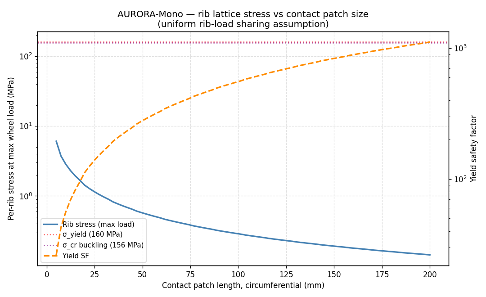

**Honest verdict.** The lattice has substantial margin in all checked load cases — yield SF and buckling SF both remain >3 even under the worst conceivable load concentration (full rock-event load on a single rib). The design is effectively over-built on this axis: the lattice volume fraction is 8% versus 1–5% for typical aerospace honeycomb, trading mass for redundancy and damage tolerance.

This screening uses a uniform-load-sharing assumption with a conservative reduction to one-rib-bears-all in the worst case. **What this does NOT capture:** rib root joint stresses where ribs meet the skins (likely the real critical location), torque transfer through the lattice during driving/braking, lateral wheel loading, dynamic amplification under impact, and non-uniform stress concentrations at rib intersections. A 3D truss FEM (or solid FEM) of the lattice with the actual contact-patch pressure distribution would give per-rib stresses with correct distribution.

Outputs: [`rib_lattice_check_summary.csv`](rib_lattice_check_summary.csv), [`rib_lattice_check_cases.csv`](rib_lattice_check_cases.csv), and [`rib_lattice_check_sensitivity.csv`](rib_lattice_check_sensitivity.csv).

## Hub bolt joint check — [`bolt_joint_check.py`](bolt_joint_check.py)

The wheel attaches to the suspension through 8× #10-32 UNF mounting bolts on a Ø 4.000 in bolt circle, plus 2 jack bolts and 2 alignment pins, all passing through a 6 mm composite (PEKK-CNT/CF) hub adapter plate with 12 mm Ø pad bosses at each hole.

The joint sees four load components, decomposed onto the bolt pattern with uniform-sharing assumed:

| Component | Source | Per-bolt effect |
|---|---|---|
| Radial load F_R | Wheel-ground contact (max 612 N) | Direct shear |
| Drive torque T = F_R · μ · R (max 77 N·m) | Traction at the contact patch | Tangential shear at the bolt circle |
| Lateral F_L (30% of F_R, cornering) | Side loading | Direct shear |
| Axial moment M = F_R · offset | F_R acts at the wheel mid-plane, offset 102 mm from the bolt plane | Tension on the most-loaded bolts |

**Per-bolt loads under the max rock event:**

| Quantity | Value |
|---|---|
| Tension per bolt (worst position) | 306 N |
| Shear per bolt (combined radial + torque) | 206 N |

**Preloaded-bolt mechanics** — A286 stainless aerospace bolt at 70% of proof preload, joint stiffness ratio C = 0.30:

| Quantity | Static cruise | Max rock event |
|---|---|---|
| Bolt tension F_b = F_i + C·F_e | 8,349 N | 8,422 N |
| Bolt stress | 739 MPa | 746 MPa |
| **Yield SF** (vs σ_y = 1,030 MPa) | **1.39** | **1.38** |
| Tensile SF (vs σ_tu = 1,240 MPa) | 1.68 | 1.66 |
| Shear SF (vs shear cap = 8,407 N) | 198 | 41 |
| Separation SF (F_e_sep / F_e) | 187 | 39 |

**Composite hub plate checks:**

| Mode | Stress | Allowable | SF |
|---|---|---|---|
| Bolt-shank bearing on hole edge | 7.1 MPa | 200 MPa | 28 |
| **Pad-boss compression under preload** | **88 MPa** | **160 MPa** | **1.8** |

**Pin shear** (2× Ø 6.355 mm alignment pins, carbon steel): per-pin capacity 15.2 kN, worst-case demand 822 N if pins take 100% of shear → SF 19.

**Sensitivity sweep** on bolt material and preload level (the two design knobs):

| Material | Preload % | Yield SF | Separation SF | Pad SF |
|---|---|---|---|---|
| A286 stainless | 50% | 1.92 | 28 | 2.55 |
| A286 stainless | **70%** (nominal) | **1.38** | **39** | **1.82** |
| A286 stainless | 90% | 1.08 | 50 | 1.42 |
| Ti-6Al-4V | 50% | 2.14 | 21 | 3.33 |
| Ti-6Al-4V | 70% | 1.53 | 30 | 2.38 |
| Ti-6Al-4V | 90% | 1.20 | 38 | 1.85 |
| 316 stainless | 50–90% | **0.53–0.94** | 13–23 | 3.03–5.45 |

**Honest verdict**

The governing margin is the bolt yield SF at **1.38** (A286, nominal preload). That's marginal-but-positive — typical for preloaded bolts loaded near proof, and acceptable for screening. The **pad-boss compression SF of 1.82** is the more interesting concern: the composite under the 12 mm pad must support the bolt's clamping force at 88 MPa, comfortably below the 160 MPa compressive allowable but tight enough that creep relaxation at +127 °C would matter over a long mission.

**Two engineering options to improve margin if needed:**

- **Ti-6Al-4V bolts at 50% preload:** yield SF 2.14, pad SF 3.33. Also saves mass.
- **Larger pad bosses (e.g. 16 mm Ø)** would directly increase pad SF without changing the bolt design.

**316 stainless will not work for this joint** under any preload — yield SF drops below 1.0 because the 316SS yield strength is much lower than aerospace-grade alloys.

**This check does NOT capture:**

- **PEKK pad-boss creep under sustained preload at +127 °C** — would relax bolt clamp force over the lunar day, with knock-on effects on joint stiffness and bolt fatigue. The pad compression SF of 1.82 is initial-condition only.
- Thermal cycling of the bolt (steel CTE 12 ppm/K vs PEKK-CNT/CF ~10 ppm/K vs SiC-PEKK ~29 ppm/K) cycling preload.
- Bolt fatigue under wheel-rotation cyclic loading with proper Goodman analysis (preload dominates, but worth confirming).
- 3D FEM resolution of non-uniform load sharing across the 8 bolts.

Outputs: [`bolt_joint_check_summary.csv`](bolt_joint_check_summary.csv) and [`bolt_joint_check_sensitivity.csv`](bolt_joint_check_sensitivity.csv).

## Launch-load check — [`launch_load_check.py`](launch_load_check.py)

Spaceflight hardware typically sees three classes of launch load: quasi-static (4–8 g sustained), random vibration (broadband 20–2000 Hz, reacted as Miles' equivalent static load), and pyro shock (short, high-frequency — not analyzed here). The wheel sees these as inertial reactions on its 2.30 kg mass, transmitted through the hub bolt joint.

**Launch envelope:**

| Load class | Level |
|---|---|
| QS axial (along launch direction) | 6.0 g |
| QS lateral | 3.0 g |
| Random vib (nominal payload PSD, flat) | 0.04 g²/Hz |
| Random vib (aggressive qual) | 0.10 g²/Hz |
| Damping ratio / Q | 0.05 / Q = 10 |

**First-mode estimate** (wheel as a lumped mass on the 6 composite hub web spokes, each treated as a parallel cantilever beam):

| Quantity | Value |
|---|---|
| Spoke length (hub pilot to inner rim) | 163 mm |
| Spoke average thickness | 4.0 mm |
| Stiffness per spoke (radial bending) | 3.3 N/mm |
| Total stiffness (6 spokes ∥) | 19.8 N/mm |
| **First mode estimate** | **~15 Hz** |

**Note on the 15 Hz result:** That's low — below the typical 100 Hz threshold for launch hardware. The estimate uses a worst-direction cantilever bending model, which is conservative; a real modal analysis with realistic suspension boundary conditions would likely give a higher number. Still, the spoke compliance is the dominant flexibility and a real value <100 Hz is plausible.

**Hub bolt joint SFs under launch loads** (A286 stainless, 70% preload):

| Case | Tension/bolt | Shear/bolt | Yield SF | Separation SF | Pad SF |
|---|---|---|---|---|---|
| QS only | 51 N | 9 N | 1.39 | 234 | 1.82 |
| QS + Miles RV (nominal PSD, f_n = 15 Hz) | 139 N | 27 N | 1.39 | 85 | 1.82 |

**Comparison — launch vs operational driving:**

| Per-bolt load | Worst rock event (operational) | QS launch | QS + RV launch |
|---|---|---|---|
| Tension | 306 N | 51 N | 139 N |
| Shear | 77 N | 9 N | 27 N |

**Driving loads dominate**, not launch — the wheel mass is small enough (2.3 kg) that 6 g axial plus reasonable random-vib amplification doesn't exceed the per-bolt tension already imposed by a max-rock event during driving. The bolt yield SF stays at 1.39 (governed by preload) and pad SF at 1.82 in either load case.

**Sensitivity** on first natural frequency at three PSD levels:

| f_n (Hz) | G_3σ (PSD low) | G_3σ (PSD nom) | G_3σ (PSD high) | Yield SF | Pad SF |
|---|---|---|---|---|---|
| 50 | 8.4 g | 16.8 g | 26.6 g | 1.38 | 1.82 |
| 100 | 11.9 g | 23.8 g | 37.6 g | 1.38 | 1.82 |
| 500 | 26.6 g | 53.2 g | 84.1 g | 1.36 | 1.82 |
| 2000 | 53.2 g | 106.3 g | 168.1 g | 1.32 | 1.82 |

The bolt yield SF barely moves across the sweep because the bolt preload (8.3 kN) dominates the external launch loads (a few hundred N at most). The pad compression SF is also preload-dominated and doesn't depend on external load.

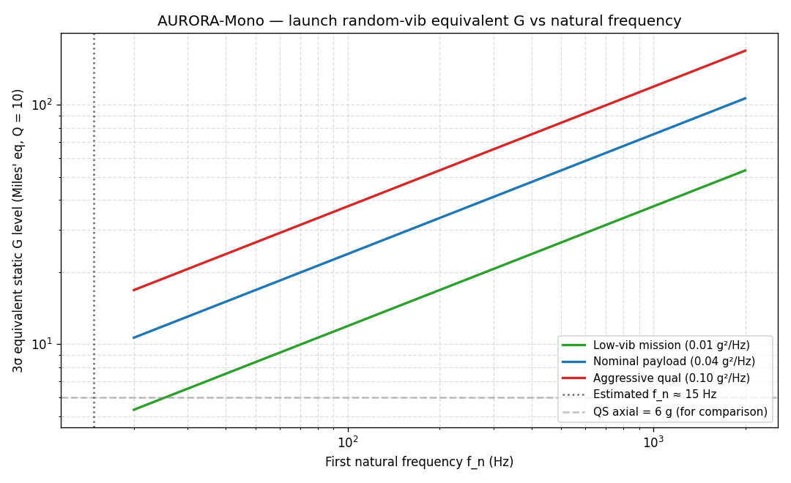

**Honest verdict.** Launch loads do **not** govern this wheel design — operational driving loads are larger on a per-bolt basis. The bolt joint margins from the operational check (yield SF 1.38, pad SF 1.82) are not made worse by launch. The 15 Hz first-mode estimate is the one flag worth following up: it's below the typical 100 Hz launch threshold and could result in resonance amplification not captured by this Miles' screening; a real modal analysis with rover suspension restraint is the next step.

**This check does NOT cover:**

- Lattice and skin response to distributed inertial body loads under launch g-levels (only the hub joint is checked here)
- Modal analysis with realistic suspension boundary conditions
- Pyro shock, acoustic loading
- Coupled-loads analysis with the launch vehicle's response

Outputs: [`launch_load_check_summary.csv`](launch_load_check_summary.csv) and [`launch_load_check_sensitivity.csv`](launch_load_check_sensitivity.csv).

## Design iteration on the static-peel mitigation — [`design_iteration_check.py`](design_iteration_check.py)

The thermal-cycle and viscoelastic-relaxation checks identified a static peel SF of 0.88 at the lug-to-skin bond on the first cool-down — the dominant identified failure-mode candidate. This script evaluates five design mitigations, alone and in combination, against the goal of recovering peel SF ≥ 1.5.

**Mitigations modeled:**

| ID | Mitigation | Parameter change |
|---|---|---|
| (A) | Compliant unfilled-PEKK interlayer between tread and skin | thickness, 0.25–2.0 mm |
| (B) | Reformulated SiC-PEKK with higher SiC vol fraction | α_tread: 29 → 20 ppm/K |
| (C) | Lower-CTE skin under lugs | α_skin: 10 → 8 ppm/K |
| (D) | Edge geometry (chamfered lug bases) | peel recovery: 0.40 → 0.25 |
| (E) | Active/passive thermal management | ΔT: 300 → 200 K |

Compliant-interlayer effect on edge peel uses a Hart-Smith-style shear-lag heuristic calibrated to ~50% reduction at 1.0 mm interlayer thickness — consistent with published behavior for thermoplastic shim layers.

**Each mitigation alone:**

| Mitigation | Edge peel | SF | Meets target (≥1.5)? |
|---|---|---|---|
| Baseline (no mitigation) | 11.40 MPa | **0.88** | ✗ |
| (A) +0.5 mm interlayer | 8.09 MPa | 1.24 | ✗ |
| (A) +1.0 mm interlayer | 6.26 MPa | **1.60** | ✓ |
| (A) +1.5 mm interlayer | 5.11 MPa | 1.96 | ✓ |
| (A) +2.0 mm interlayer | 4.32 MPa | 2.32 | ✓ |
| (B) Reformulated tread | 6.00 MPa | **1.67** | ✓ |
| (C) Lower-CTE skin | 12.60 MPa | **0.79** | ✗ — makes it *worse* |
| (D) Edge geometry | 7.12 MPa | 1.40 | ✗ (close) |
| (E) Thermal management | 7.60 MPa | 1.32 | ✗ |

**Note on (C):** lowering the skin CTE *increases* the differential Δα (from 19 to 21 ppm/K) since the skin is already the lower-CTE layer. The screening model correctly catches this — the mitigation as originally listed in the thermal-cycle check was wrong in direction; the right intent was probably "more compliant skin" via lower modulus, not lower CTE. (C) is therefore retired from the recommendation stack.

**Combinations (stacked mitigations):**

| Stack | Edge peel | SF |
|---|---|---|
| (A, 1.0 mm) + (D) edge geometry | 3.92 MPa | 2.55 |
| (A, 1.0 mm) + (B) reformulated tread | 3.30 MPa | 3.03 |
| (A, 1.0 mm) + (B) + (D) | **2.06 MPa** | **4.85** |
| (B) + (D) (no interlayer) | 3.75 MPa | 2.67 |
| (B) + (D) + (E) | 2.50 MPa | 4.00 |
| All five (A=1.0 mm, B, C, D, E) | 1.65 MPa | 6.07 |

**Minimum stacks that hit SF ≥ 1.5:**

| Candidate | Required parameters | SF |
|---|---|---|
| (A) alone | 0.90 mm interlayer | 1.52 |
| (A) + (D) | 0.25 mm interlayer + edge geometry | 1.69 |
| (B) + (D), no interlayer | reformulated tread + edge geometry | 2.67 |
| (D) + (E), no interlayer or reformulation | edge geometry + thermal management | 2.10 |

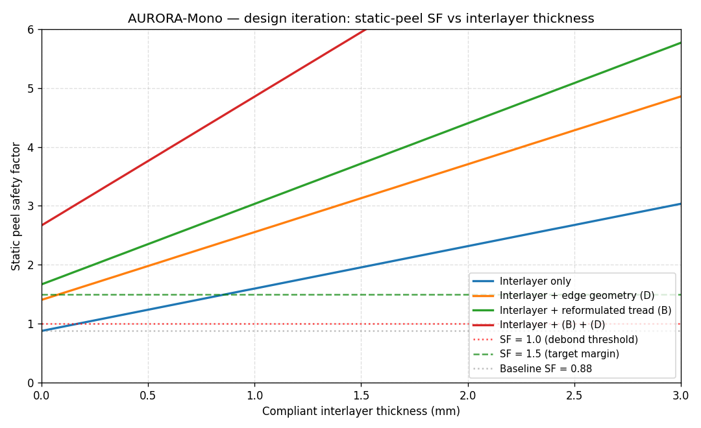

**Recommendation: stack (A 1.0 mm) + (B reformulated) + (D edge geometry)**

| Quantity | Value |
|---|---|
| Static peel SF | **4.85** (5.5× improvement over baseline) |
| Edge peel stress | 2.06 MPa |
| Margin vs bond endurance (2.5 MPa) | below — fatigue also resolved |

**Rough impact of the recommended stack:**

- **Mass:** ~50–100 g per wheel of unfilled-PEKK interlayer
- **Process:** adds one molding step for the interlayer; reformulated tread requires SiC loading and process tuning
- **Cost:** modest increase in tread material cost; minor tooling change for edge geometry

This recommendation should be validated by 3D viscoelastic FEM with the proposed interlayer in place, coupon-test peel data for the SiC-PEKK / unfilled-PEKK / PEKK-CNT/CF stack, and re-running the bond-shear, lug-peel, and fatigue checks with the new layer included.

Outputs: [`design_iteration_alone.csv`](design_iteration_alone.csv) and [`design_iteration_combos.csv`](design_iteration_combos.csv).

## Files in this folder

```
aurora-mono-simulations/
├── README.md                              (this file)
├── aurora_mono_screening_model.py         (main screening model + run_screening() API)
├── aurora_mono_screening_summary.csv      (1-row mission summary)
├── aurora_mono_screening_records.csv      (50k-row per-segment log)
├── sensitivity_sweep.py                   (±50/25% sweep on 4 params)
├── sensitivity_sweep_results.csv          (20-row sweep result table)
├── lug_shear_check.py                     (bond-shear screening check)
├── lug_shear_check_results.csv            (lug-shear screening result)
├── peel_check.py                          (bond-peel screening check)
├── peel_check_results.csv                 (5 peel load/eccentricity cases)
├── peel_check_sensitivity.csv             (15-row sensitivity grid)
├── fatigue_check.py                       (Miner's-rule fatigue accumulator)
├── fatigue_check_summary.csv              (skin + bond fatigue summary)
├── fatigue_check_sensitivity.csv          (27-row bond fatigue sensitivity)
├── thermal_cycle_check.py                 (CTE-mismatch thermal cycling)
├── thermal_cycle_check_summary.csv        (single-cycle + fatigue summary)
├── thermal_cycle_check_sensitivity.csv    (25-row Δα × recovery sweep)
├── viscoelastic_relaxation_check.py       (Prony-series upgrade, NOT FEM)
├── viscoelastic_relaxation_summary.csv    (3-cycle stress + fatigue result)
├── viscoelastic_relaxation_sensitivity.csv (Ea/R × permanent-term sweep)
├── rib_lattice_check.py                   (helical X-brace lattice)
├── rib_lattice_check_summary.csv          (geometry + buckling + shear summary)
├── rib_lattice_check_cases.csv            (5 named per-rib load cases)
├── rib_lattice_check_sensitivity.csv      (8-row contact-patch sweep)
├── bolt_joint_check.py                    (hub bolt joint mechanics)
├── bolt_joint_check_summary.csv           (per-bolt + plate + pin summary)
├── bolt_joint_check_sensitivity.csv       (9-row material × preload sweep)
├── launch_load_check.py                   (QS + Miles random vib)
├── launch_load_check_summary.csv          (combined launch case summary)
├── launch_load_check_sensitivity.csv      (6-row f_n × PSD sweep)
├── design_iteration_check.py              (static-peel mitigation stack)
├── design_iteration_alone.csv             (each mitigation alone)
├── design_iteration_combos.csv            (stacked combinations)
└── plots/
    ├── wear_vs_distance.png
    ├── safety_factor_running_min.png
    ├── thermal_cycle.png
    ├── sensitivity_wear.png
    ├── sensitivity_min_sf.png
    ├── fatigue_stress_histograms.png
    ├── thermal_cycle_fatigue_life.png
    ├── viscoelastic_stress_trace.png
    ├── rib_lattice_sensitivity.png
    ├── launch_load_miles.png
    └── design_iteration_sf_vs_interlayer.png
```

## Open work — what would strengthen this at next fidelity

In rough order of impact:

1. **True 3D viscoelastic FEM** (FEniCS / ABAQUS / Calculix) of the lug-skin region under the diurnal cycle, with measured Prony coefficients. The actual next-fidelity step — resolves edge stresses properly, captures 3D constraint, and could either tighten or loosen the static-margin concern from the thermal-cycling check.
2. **Rib root joint analysis** — the lattice check treats ribs as pin-ended struts, but the most likely failure location in the lattice is where each rib bonds to a skin. A 3D truss FEM (or solid FEM) of the lattice with the actual contact-patch pressure distribution would give per-rib stresses with correct distribution and resolve joint stress concentrations.
3. **Bolt joint creep + fatigue under thermal cycling** — the screening bolt-joint check is initial-condition only. PEKK pad-boss creep at +127 °C would relax preload over a long mission, and full Goodman fatigue analysis under wheel-rotation cycles is recommended.
4. **Modal analysis with realistic suspension boundary conditions** — the launch-load check estimates the wheel's first mode at ~15 Hz from a free spoke-bending model, which is below the typical 100 Hz launch-hardware threshold. A real modal analysis would refine this and determine whether resonance amplification at the rover-suspension level is a concern.
5. **Lattice and skin response to distributed inertial body loads under launch** — the launch check only covers the hub joint.
5. **Coupon-test CTE values** for the two formulations (the screening uses rule-of-mixtures estimates).
6. **Coupon-test bond strength** (shear, peel, G_c, S-N) for the co-molded PEKK joint, replacing the estimated allowables.
7. **Coupon-test wear coefficients** for SiC-PEKK against JSC-1A lunar regolith simulant.
8. **Fracture-mechanics peel analysis** using G_c (Paris-law crack growth) for the actual co-mold bond.
9. **Real thermal model** — radiation balance, 1D conduction through the sandwich wall, regolith contact, sun/shadow cycling.
10. **Validation of the recommended design stack** (1.0 mm interlayer + reformulated tread + edge geometry) via 3D viscoelastic FEM, coupon-test peel data for the SiC-PEKK / unfilled-PEKK / PEKK-CNT/CF stack, and re-running the bond-shear, lug-peel, and fatigue checks with the new layer included. The design iteration check shows the proposed mitigations recover SF ~5; physical validation is still required.
11. **Steering / scrub loads** if the rover steers.
12. **Radiation environment** — UV, GCR, SPE degradation on PEKK over mission life.
13. **Physical prototype build and bench test.** No analysis replaces it.

## License

CC0 / public domain for the code. CC BY 4.0 for the writeup and plots, consistent with the rest of the repository.
